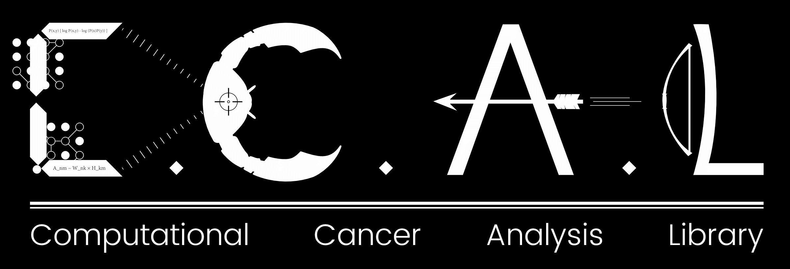

Library for hunting cancers :crab::gun:

# See big picture

CCAL itself doesn't havce much code. Instead, CCAL submodules many other cool libraries in `ccal/`, and import awesome functions from them in `ccal/__init__.py`'.

# Get started

Look at `notebooks/ccal.ipynb`, a boiler plate to use this CCAL library.

# Note

CCAL needs matplotlib>=2.0.2
